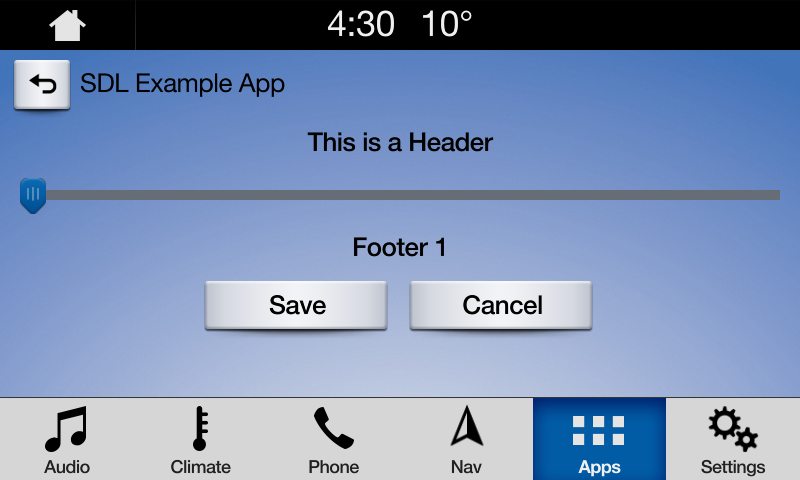
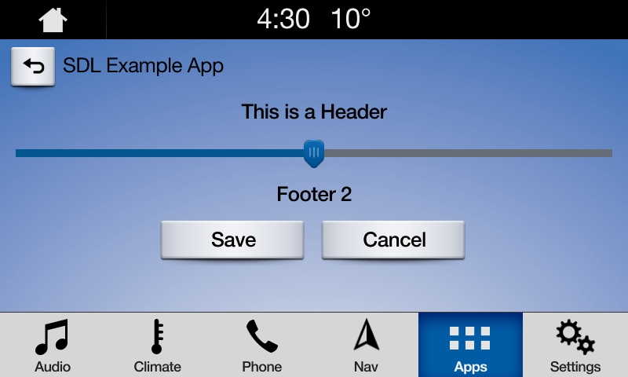

# Slider
A `SDLSlider` creates a full screen or pop-up overlay (depepednig on platform) that a user can control. HMILevel must be `FULL` in order to send a `SDLSlider` request.
There are two main `SDLSlider` layouts, one with a static footer and one with a dynamic footer.  

!!! NOTE
The slider will persist on the screen until the timeout has elapsed, or the user dismisses the slider by selecting a position and saving.
!!!

## Slider with Static Footer
This type of slider will have the same footer message displayed for each position of the slider.  The footer is an optional paramater. 

## Slider UI


## Creating the Slider

##### Objective-C
```objc
// Create a slider with number of ticks, starting position 'tick number', a header message, an optional footer message, and a timeout
SDLSlider *sdlSlider = [[SDLSlider alloc] initWithNumTicks:5 position:1 sliderHeader:@"This is a header" sliderFooter:@"This is a footer" timeout:30000];

// Send the slider RPC request with handler 
[manager sendRequest:sdlSlider withResponseHandler:^(__kindof SDLRPCRequest * _Nullable request, __kindof SDLRPCResponse * _Nullable response, NSError * _Nullable error) {
if (!response || !response.success.boolValue) {
    SDLLogE(@"Error getting the SDLSlider response");
    return;
}

// Create a SDLSlider response object from the handler response
SDLSliderResponse *sdlSliderResponse = (SDLSliderResponse *)response;
NSNumber *position = [sdlSliderResponse sliderPosition];
<#Use the slider position#>
}];
```
##### Swift
```swift
// Create a slider with number of ticks, starting position 'tick number', a header message, an optional footer message, and a timeout
let slider =  SDLSlider(numTicks: 5, position: 1, sliderHeader: "This is a header", sliderFooter: "This is a footer", timeout: 30000)

// Send the slider RPC request with handler 
manager.send(request: slider, responseHandler: { (req, res, err) in

// Create a SDLSlider response object from the handler response
guard let response = res as? SDLSliderResponse, res?.resultCode == .success, err == nil, let position = response.sliderPosition else { return }
<#Use the slider position#>
})
```

## Slider with Dynamic Footer
This type of slider will have a different footer message displayed for each  position of the slider.  The footer is an optional paramater.  The footer message displayed will be based off of the sliders current position.  The footer array should be the same length as  `numTicks` as each footer should correspond to a tick, or no footer if nil.

## Slider UI





## Creating the Slider
##### Objective-C
```objc
// Create an array of footers to diplay to the user.
NSArray<NSString *> *footers = @[@"Footer 1", @"Footer 2", @"Footer 3"];

// Create a slider with number of ticks, starting position 'tick number', a header message, and an optional footer array, and a timeout
SDLSlider *sdlSlider = [[SDLSlider alloc] initWithNumTicks:5 position:1 sliderHeader:@"This is a header" sliderFooters:footers timeout:30000];

// Send the slider RPC request with handler 

[manager sendRequest:sdlSlider withResponseHandler:^(__kindof SDLRPCRequest * _Nullable request, __kindof SDLRPCResponse * _Nullable response, NSError * _Nullable error) {
if (!response || !response.success.boolValue) {
SDLLogE(@"Error getting the SDLSlider response");
return;
}

// Create a SDLSlider response object from the handler response
SDLSliderResponse *sdlSliderResponse = (SDLSliderResponse *)response;
NSNumber *position = [sdlSliderResponse sliderPosition];
<#Use the slider position#>
}];
```

##### Swift
```swift
// Create an array of footers to diplay to the user.
let footers = ["Footer 1", "Footer 2", "Footer 3"]

// Create a slider with number of ticks, starting position 'tick number', a header message, and an optional footer array, and a timeout
let slider =  SDLSlider(numTicks: 5, position: 1, sliderHeader: "This is a header", sliderFooters:footers, timeout: 30000)
manager.send(request: slider, responseHandler: { (req, res, err) in

// Create a SDLSlider response object from the handler response
guard let response = res as? SDLSliderResponse, res?.resultCode == .success, err == nil, let position = response.sliderPosition else { return }
<#Use the slider position#>
})
```
