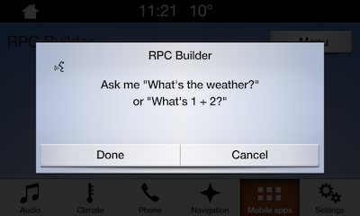

# In-Car Microphone Audio
Capturing in-car audio allows developers to interact with users via raw audio data provided to them from the car's microphones. In order to gather the raw audio from the vehicle, we must leverage the [`SDLPerformAudioPassThru`](https://smartdevicelink.com/en/docs/iOS/master/Classes/SDLPerformAudioPassThru/) RPC.

!!! NOTE
PerformAudioPassThru does not support automatic speech cancellation detection, so if this feature is desired, it is up to the developer to implement. The user may press an OK or Cancel button, the dialog may timeout, or you may close the dialog with `SDLEndAudioPassThru`.
!!!

!!! NOTE
SDL requires the OEM to implement a popup when the microphone is active for privacy reasons. Therefore, an open mic is not supported.
!!!

In order to know the currently supported audio capture capabilities of the connected head unit, please refer to the `SDLSystemCapabilityManager.audioPassThruCapabilities` [documentation](https://smartdevicelink.com/en/docs/iOS/master/Classes/SDLRegisterAppInterfaceResponse/).

!!! NOTE
Currently, SDL only supports Sampling Rates of 16 khz and Bit Rates of 16 bit.
!!!

## Starting Audio Capture
To initiate audio capture, we must construct an `SDLPerformAudioPassThru` object. The properties we will set in this object's constructor relate to how we wish to gather the audio data from the vehicle we are connected to.

##### Objective-C
```objc
SDLPerformAudioPassThru *audioPassThru = [[SDLPerformAudioPassThru alloc] initWithInitialPrompt:@"<#A speech prompt when the dialog appears#>" audioPassThruDisplayText1:@"<#Ask me \"What's the weather?\"#>" audioPassThruDisplayText2:@"<#or \"What is 1 + 2?\"#>" samplingRate:SDLSamplingRate16KHZ bitsPerSample:SDLBitsPerSample16Bit audioType:SDLAudioTypePCM maxDuration:<#Time in milliseconds to keep the dialog open#> muteAudio:YES];

[self.sdlManager sendRequest:audioPassThru];
```

##### Swift
```swift
let audioPassThru = SDLPerformAudioPassThru(initialPrompt: "<#A speech prompt when the dialog appears#>", audioPassThruDisplayText1: "<#Ask me \"What's the weather?\"#>", audioPassThruDisplayText2: "<#or \"What is 1 + 2?\"#>", samplingRate: .rate16KHZ, bitsPerSample: .sample16Bit, audioType: .PCM, maxDuration: <#Time in milliseconds to keep the dialog open#>, muteAudio: true)

sdlManager.send(audioPassThru) 
```

##### Ford HMI


### Gathering Audio Data
SDL provides audio data as fast as it can gather it, and sends it to the developer in chunks. In order to retrieve this audio data, the developer must add a handler to the `SDLPerformAudioPassThru`.

!!! NOTE
This audio data is only the current chunk of audio data, so the developer must be in charge of managing previously retrieved audio data.
!!!

##### Objective-C
```objc
SDLPerformAudioPassThru *audioPassThru = [[SDLPerformAudioPassThru alloc] initWithInitialPrompt:@"<#A speech prompt when the dialog appears#>" audioPassThruDisplayText1:@"<#Ask me \"What's the weather?\"#>" audioPassThruDisplayText2:@"<#or \"What is 1 + 2?\"#>" samplingRate:SDLSamplingRate16KHZ bitsPerSample:SDLBitsPerSample16Bit audioType:SDLAudioTypePCM maxDuration:<#Time in milliseconds to keep the dialog open#> muteAudio:YES];

audioPassThru.audioDataHandler = ^(NSData * _Nullable audioData) {
    // Do something with current audio data.
    if (audioData.length == 0) { return; }
    <#code#>
}

[self.sdlManager sendRequest:audioPassThru];
```

##### Swift
```swift
let audioPassThru = SDLPerformAudioPassThru(initialPrompt: "<#A speech prompt when the dialog appears#>", audioPassThruDisplayText1: "<#Ask me \"What's the weather?\"#>", audioPassThruDisplayText2: "<#or \"What is 1 + 2?\"#>", samplingRate: .rate16KHZ, bitsPerSample: .sample16Bit, audioType: .PCM, maxDuration: <#Time in milliseconds to keep the dialog open#>, muteAudio: true)

audioPassThru.audioDataHandler = { (data) in
    // Do something with current audio data.
    guard let audioData = data else { return }
    <#code#>
}

sdlManager.send(audioPassThru) 
```

#### Format of Audio Data
The format of audio data is described as follows:
- It does not include a header (such as a RIFF header) at the beginning.
- The audio sample is in linear PCM format.
- The audio data includes only one channel (i.e. monaural).
- For bit rates of 8 bits, the audio samples are unsigned. For bit rates of 16 bits, the audio samples are signed and are in little endian.

## Ending Audio Capture
Perform Audio Pass Thru is a request that works in a different way than other RPCs. For most RPCs, a request is followed by an immediate response, with whether that RPC was successful or not. This RPC, however, will only send out the response when the PerformAudioPassThru is ended.

Audio Capture can be ended in 4 ways:

1. Audio Pass Thru has timed out.

If the Audio Pass Thru has proceeded longer than the requested timeout duration, Core will end this request with a `resultCode` of `SUCCESS`. You should expect to handle this Audio Pass Thru as though it was successful.

2. Audio Pass Thru was closed due to user pressing "Cancel".

If the Audio Pass Thru was displayed, and the user pressed the "Cancel" button, you will receive a `resultCode` of `ABORTED`. You should expect to ignore this Audio Pass Thru.

3. Audio Pass Thru was closed due to user pressing "Done".

If the Audio Pass Thru was displayed, and the user pressed the "Done" button, you will receive a `resultCode` of `SUCCESS`. You should expect to handle this Audio Pass Thru as though it was successful.

4. Audio Pass Thru was ended due to the developer ending the request.

If the Audio Pass Thru was displayed, but you have established on your own that you no longer need to capture audio data, you can send an `SDLEndAudioPassThru` RPC.

##### Objective-C
```objc
SDLEndAudioPassThru *endAudioPassThru = [[SDLEndAudioPassThru alloc] init];
[self.sdlManager sendRequest:endAudioPassThru];
```

##### Swift
```swift
let endAudioPassThru = SDLEndAudioPassThru()
sdlManager.send(endAudioPassThru)
```

You will receive a `resultCode` of `SUCCESS`, and should expect to handle this audio pass thru as though it was successful.

## Handling the Response
To process the response that we received from an ended audio capture, we use the `withResponseHandler` property in `SDLManager`'s `send(_ :)` function.

##### Objective-C
```objc
[self.sdlManager sendRequest:performAudioPassThru withResponseHandler:^(__kindof SDLRPCRequest * _Nullable request, __kindof SDLRPCResponse * _Nullable response, NSError * _Nullable error) {
    if (error || ![response isKindOfClass:SDLPerformAudioPassThruResponse.class]) {
        NSLog(@"Encountered Error sending Perform Audio Pass Thru: %@", error);
        return;
    }
    
    SDLPerformAudioPassThruResponse *audioPassThruResponse = (SDLPerformAudioPassThruResponse *)response;
    SDLResult *resultCode = audioPassThruResponse.resultCode;
    if (![resultCode isEqualToEnum:SDLResultSuccess]) {
        // Cancel any usage of the audio data
    }
    
    // Process audio data
}];
```

##### Swift
```swift
sdlManager.send(request: performAudioPassThru) { (request, response, error) in
    guard let response = response else { return }

    guard response.resultCode == .success else {
        // Cancel any usage of the audio data.
        return
    }
    
    // Process audio data
}
```
